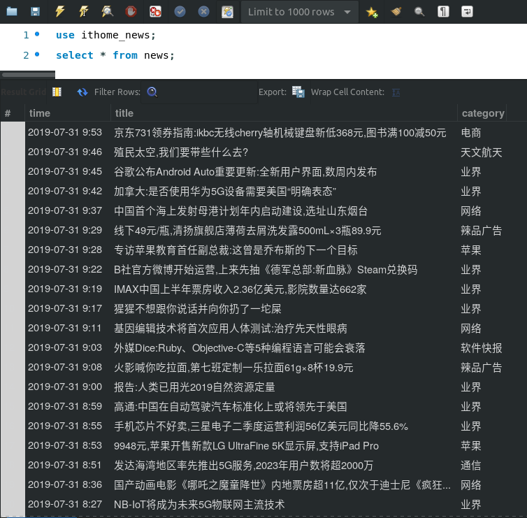
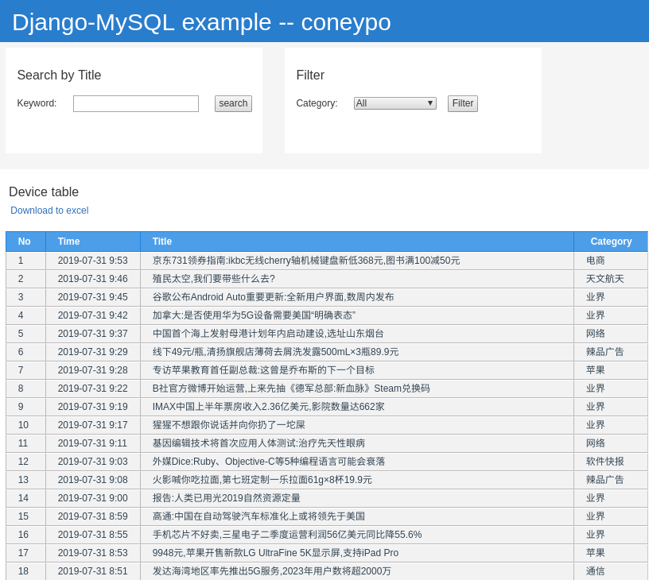

Django-MySQL Dashboard
######################

Introduction
************

An initial version of using Django as the website development tool
based on python and show your data in MySQL database;

Overview
********

Check the data in MySQL database by MySQL Workbench:

And the dashboard website will be like:

How to run
**********

#. Log into MySQL database

#. Add the example database of news:

   .. code-block:: bash

      mysql> create database ithome_news;
      mysql> use ithome_news;
      mysql> source /home/con/code/python/Django_MySQL_Table/ithome_news.sql

#. Modify password for your database in setting.py

   .. code-block:: bash

         # Database
         DATABASES = {
            'default': {
            'ENGINE': 'django.db.backends.mysql',
            'NAME': 'ithome_news',
            'USER': 'root',
            ######## modify with your password here ########
            'PASSWORD': 'pwd',
            ################################################
            'CONN_MAX_AGE': 3600,
            }
            }

#. Run Django server

   .. code-block:: bash

      python3 manage.py runserver 8000

#. Open browser and input http://127.0.0.1:8000/table_example

More
****
Thanks for your support.